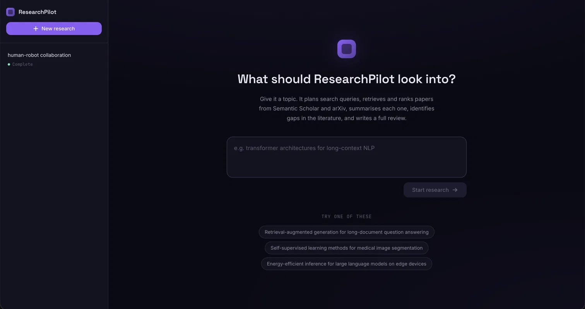
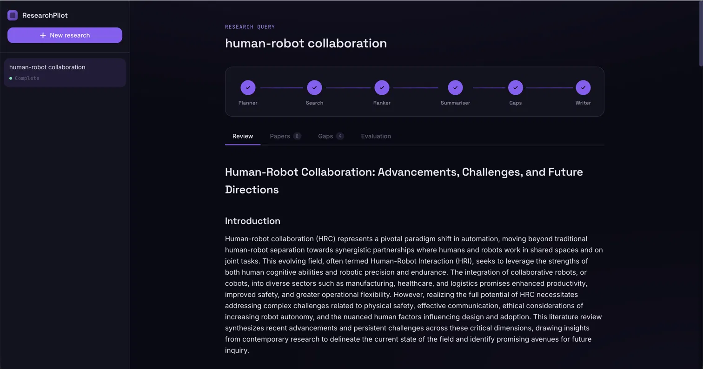
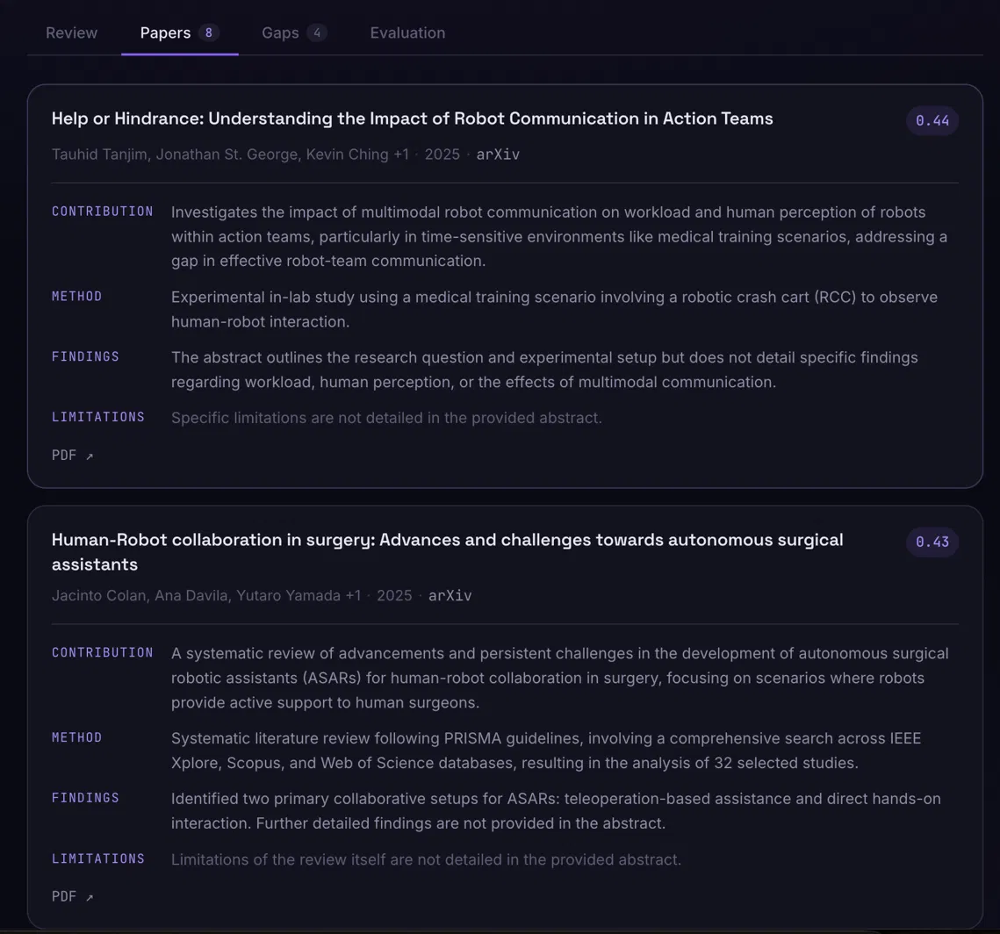
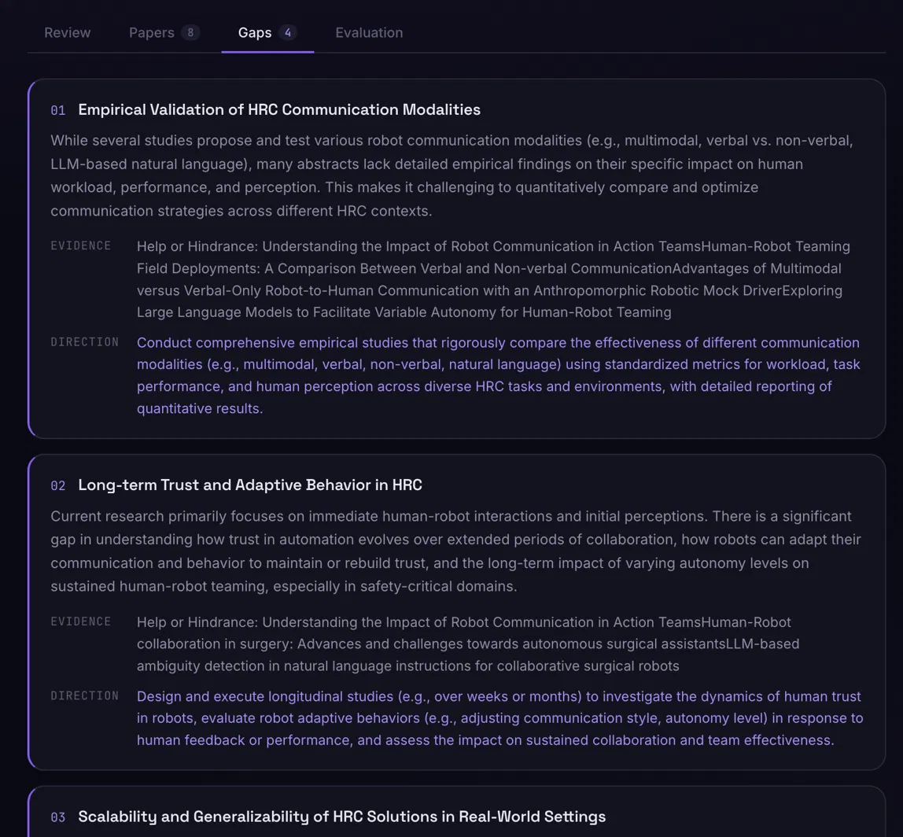

# ResearchPilot

An autonomous multi-agent academic research assistant. Give it a topic — it plans search queries, retrieves and ranks papers from Semantic Scholar and arXiv, summarises each one, identifies gaps in the literature, and writes a full literature review.

> **Status: Active development.** Core pipeline is functional. Formal testing and benchmarking in progress.
This project was built with help from Claude (frontend, debugging, and documentation).
---

---

## What it does

One query in. One structured research package out.

- **Query planning** — decomposes your topic into subtopics and targeted search queries using single-call chain-of-thought self-refinement
- **Dual-source search** — queries Semantic Scholar and arXiv concurrently, deduplicates, and enriches arXiv papers with citation data
- **Semantic ranking** — scores papers across four configurable dimensions (semantic relevance, citations, recency, venue quality) using local embeddings
- **Batched summarisation** — structured per-paper analysis across contribution, methodology, findings, and limitations
- **Gap analysis** — identifies what the literature hasn't addressed and suggests concrete research directions
- **Literature review** — synthesises everything into a full academic-tone review in Markdown
- **Quality evaluation** — scores output across 5 dimensions on demand
- **Live progress** — real-time pipeline tracking via Server-Sent Events

---

## Screenshots

---

## Stack

| Layer | Tech |
|---|---|
| Backend | Python 3.12, FastAPI, LangGraph |
| LLM | Google Gemini 2.5 Flash |
| Search | Semantic Scholar API, arXiv API |
| Embeddings | sentence-transformers (`all-MiniLM-L6-v2`, local) |
| Database | SQLite + aiosqlite |
| Frontend | React 18 + Vite |

---

## Roadmap

- [ ] Formal test suite and benchmarking harness
- [ ] PDF extraction for richer summarisation and gap analysis
- [ ] Contradiction/consensus detection across papers
- [ ] Conversational refinement (re-run on cached results)
- [ ] Citation graph visualisation

---

## Known limitations

- Evaluation scores for Relevance, Gap Quality, and Coherence are self-reported by the same model that generated the review
- Gap analysis operates on abstracts only — PDF extraction is the planned fix
- Venue ranking defaults to ML/AI-heavy tiers; configurable via `venue_tiers.json`
